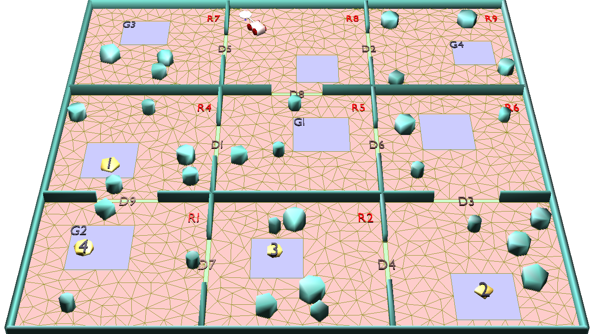

# ActionAndMotionPlanner
Interactive Search for Action and Motion Planning with Dynamics

[ "Interactive Search for Action and Motion Planning with Dynamics." Journal of Experimental and Theoretical Artificial Intelligence, vol. 28, pp. 849–869](http://www.robotmotionplanning.org/papers/PaperJETAI16.pdf)



## Prerequisites
- OPENGL library
- GLUT library
- BOOST library
- Pybullet library
- PDDL :fast-downward

## Getting Started
```
cmake -DCMAKE_BUILD_TYPE="Release"
make
./bin/Abetare GRunPlanner data/Prob3x3_Obj4_1.txt
```
- Press "r" until solved.

### Video Demonstration
<a href="http://www.youtube.com/watch?feature=player_embedded&v=kb79tR5bmlE
" target="_blank"></a>

## License

Please contact me via lesun90@gmail.com if you want to use this code for your work.
